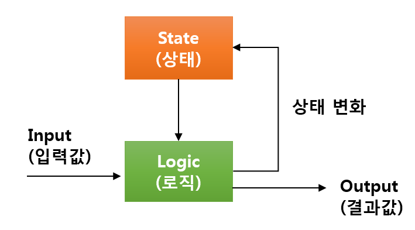
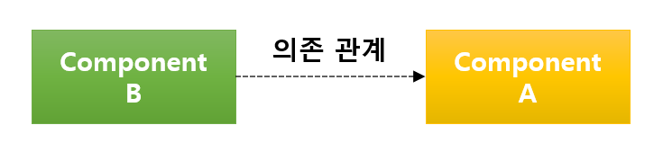
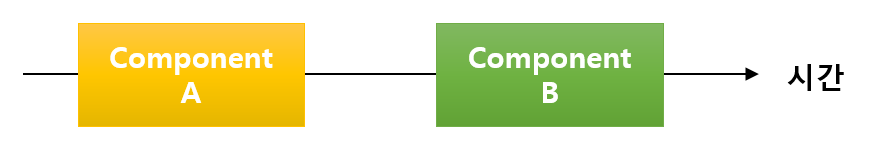
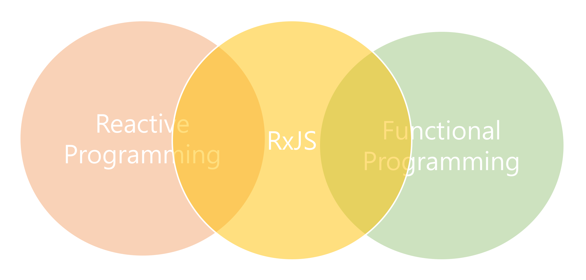

# RxJS를 시작하기 전에

처음 개발을 시작할 때는 비즈니스 문제를 어떻게 프로그래밍 할 것인지에 대한 고민을 하게 된다.
이것은 개발에서는 굉장히 중요한 문제이다. 
하지만, 초급 개발자 딱지를 막 떼기 시작한 이후 부터는 구현 보다는 소프트웨어를 얼마나 효과적으로 유지보수 할 수 있는지?
또는 얼마나 많은 문제점들을 설계나 테스트 코드를 통해 사전에 해결할 수 있을지를 고민하게 된다.
그래서 우리는 자연스레 기존 문제들을 해결하기 위해 고심했던 라이브러리나, 프로그램 패턴들을 하나 둘씩 적용하게 되고, 결국에는
이런 고민들이 녹아들어간 프레임워크에 관심을 갖게된다.
이런 고민의 과정 없이 처음부터 프레임워크를 배우는 개발자가 있다면 이런 도구와 환경들은 오히려 그에게는 독이 될 확률이 높다.

기술의 이해도를 높이고 활용도를 높이기 위해서는 결과물을 잘 사용하고 활용하는 것도 중요하지만 그 기술의 결과물이 어떤 고민에 의해 나온 것인지 부터 알게되는게 더 중요하다.
고민의 원인을 알게 되면 그 기술을 보다 깊게 이해할 수 있고 보다 효과적으로 사용할 수 있다.

이번 장에서는 RxJS를 본격적으로 이야기 하기 전에 RxJS가 어떤 기술적 고민을 갖고 나오게 되었는지에 대해 배경 지식을 살펴보고, RxJS가 무엇인지 간략하게 살펴보도록 하자.

## 웹 환경의 변화
1990년 인터넷의 등장을 시작으로 지금까지 웹기술은 급격하게 발전하였다.
서버(Server)와 클라이언트(Client) 시스템 구조가 서버(Server)와 브라우저로 구성된 웹 시스템으로 바뀌었다.
뿐만 아니라, 웹의 대중화와 더불어 웹브라우저 기술 또한 급속도로 발전하게 되었다. 대표적인 변화의 첫번째 기술이 바로 Ajax 이다.
Ajax 이전에는 서버 데이터를 받기 위해 매번 브라우저 페이지를 새로 그려야만 했다.
하지만, Ajax 기술의 도입으로 페이지 전환없이 데이터를 받을 수 있게 되었으며, 받은 데이터를 바로 화면에 반영할 수 있게 되었다.
심지어, 페이지가 하나인 형태의 웹어플리케이션이 나오기도 했다. 

> ##### SPA (Single Page Application)
> - 페이지가 하나인 형태의 웹어플리케이션
> - 이런 대표적인 서비스가 바로 Gmail과 같은 웹메일이다. 
> - 이 책에서는 SPA를 웹 어플리케이션이라는 용어와 같은 의미로 사용하겠다. 

뿐만 아니라, Web Storage, Web Worker와 같이 어플리케이션을 구성하기 위해 필요한 요소 기술들이 브라우저에서 지원하기 시작하면서부터, 주로 비즈니스 문제를 다루었던 서버의 역할이 점차 클라이언트인 브라우저가 담당하게 되었다.

이런 환경의 변화는 궁극적으로 사용자에게 좋은 사용성과 편리함을 제공하지만 웹 서비스 개발은 더욱 더 복잡해졌다.

## 웹 개발 복잡도 증가
기존의 웹 개발은 기능별로 페이지가 하나 씩 다 존재했다. 메일을 쓰는 기능은 메일을 쓰는 페이지 write.jsp에 있었고, 
메일 목록을 보여주는 기능은 list.jsp에 있었다. 
페이지에서는 if문 몇개와 for문 몇개만으로 화면상에서 발생하는 동적인 요소의 처리가 가능했다.
화면상의 로직의 변화는 많지 않았고, 복잡하지도 않았다. 더군다나 요청때마다 화면이 바뀌기 때문에 기존에 존재했던 상태는 자동으로 초기화가 되었다.

하지만, 웹 어플리케이션인 경우에는 초기 로딩되는 index.jsp 페이지만 존재한다. 메일을 쓰는 기능은 write.js에 있고,
메일 목록을 보여주는 기능은 list.js에 있지만, 모두 하나의 페이지 index.jsp에 존재한다.
메일을 쓰는 기능은 메일을 보여주는 기능에 의해 영향을 받을 수 밖에 없다. 
뿐만아니라, 메일목록에서 보았던 화면에 대한 정보는 페이지를 reload 하지 않는 이상 자동으로 초기화 되지 않았다.
이런 구조는 기능이 추가 될수록 기존의 상태에 복잡하게 엮일 수 밖에 없다. 

그렇다면 이런 복잡한 웹어플리케이션을 좀 더 쉽게 개발할 수는 없을까?  
웹어플리케이션에서 발생하는 오류들을 개발자가 통제할 수 있는 방법은 없을까?  
이런 문제를 해결하기 위해서는 우선 웹어플리케이션의 기본적인 특징에 대해 살펴볼 필요가 있다. 

## 웹어플리케이션은 상태머신이다.
주어진 시간의 상태(State)가 존재하고, 어떤 한 사건(input)에 의해 다른 상태(State)으로 변화할수 있는 수학적인 모델을 우리는 상태머신이라고 한다.

상태머신은 다음과 같이 동작한다.
1. 시스템으로 input이 발생한다.
2. 프로그램 로직은 input과 현재 프로그램 상태에 따라 행위를 결정한다.
3. 프로그램 로직은 결정에 따라, 프로그램 상태를 변경한다.
4. 경우에 따라서는 프로그램 로직은 output을 생산하기도 한다.

이를 '레이어를 토글링 하는 기능'이 구현된 웹어플리케이션에 적용해보자.
1. 사용자가 버튼을 누르는 input을 주면, 
2. 웹어플리케이션은 현재 레이어가 닫혀있는 상태인지? 아니면 열려있는 상태인지에 따라, 레이어를 열지 아니면 레이어를 닫을지를 결정한다.
3. 레이어가 열려있다면, 레이어를 닫는 상태로 바꿔주고, 레이어가 닫혀있다면, 레이어를 열려있는 상태로 변경하고,
4. 레이어의 DOM에 상태를 적용한다.

웹어플리케이션에서 구현된 기능은 상태머신에서 말하는 `입력값(input)`과 `기존 상태값`. `로직`에 따라 `현재의 상태`가 결정된다.
웹어플리케이션은 이런 기능들의 집합으로 구성되어 있다. 따라서, 크게 보면 웹어플리케이션도 하나의 큰 상태머신인 셈이다.

## 웹어플리케이션 오류가 발생하는 경우
사용자의 입력에 따라 프로그램이 예상하는 결과를 얻지 못하는 것을 우리는 `프로그램의 오류`라고 이야기한다.
복잡성이 높은 웹어플리케이션에서는 자칫 이런 오류를 발생할 수 있게 된다. 

웹어플리케이션이 하나의 상태 머신이라고 본다면 정확한 입력과 로직으로 상태를 어떻게 관리하느냐가 중요하다.
이에 따라 오류가 발생하느냐? 안하느냐가 결정된다.
이는 웹어플리케이션을 구성하고 있는 크고 작은 단위들에게도 똑같이 적용될수 있는 말이다.
각각의 클래스 또는 컴포넌트의 상태 변화에 따라 웹어플리케이션의 상태가 결정된다.
궁극적으로는 각 구성요소들의 상태관리를 어떻게 하느냐에 따라 안정적인 어플리케이션을 만들 수 있다.

프로그램에서 오류가 나타나는 경우는 어떤 경우가 있을까?
 - 입력된 값/타입이 잘못 전달 된 경우. 
 - 입력된 값이 명확하지 않는 경우.
 - 입력된 값이 준비되지 않은 상태에서 전달된 경우.
 - 의존 관계에 있는 구성요소들의 상태 변화가 전달되지 않아서 발생하는 경우.
 - 구성 요소들간의 호출 순서에 의존도가 있는 경우에 구성요소들이 호출 순서가 틀린경우.
 - 조건문에 의해 로직 처리가 잘못된 경우.
 - 로직의 연산이 잘못되어 발생하는 경우.

위에 제시한 경우를 제외하고도 많은 경우 오류가 발생할 수 있다.
하지만 궁극적으로 웹어플리케이션은 상태머신이기 때문에 크게 3가지 요소에서 오류가 발생할 수 있다.

### 입력 오류
각 구성요소에게 정확한 입력값을 전달하는 문제는 단순히 값을 전달하는 것이기 때문에 쉽게 생각할 수 있지만 쉬운 문제만은 아니다.

서버로부터 전달 받은 데이터를 입력값으로 사용하는 경우를 생각해보자.
이 경우에는 서버로 전달 받은 응답 결과값이 정상적으로 왔을 경우에 입력값을 전달해야한다. 응답 데이터의 결과가 미처 오기도 전에 데이터를 입력값으로 전달하거나 응답 중에 에러가 발생하여 정상적으로 응답 데이터를 못받은 결과를 입력값으로 전달하면 오류가 발생할 수 있다. 

이처럼 입력값의 결과가 외부로부터 전달받는 경우라면 입력값을 별도로 제어할 필요가 있다. 더불어 처리 도중 오류가 발생하면 이에 대한 오류처리도 해야만한다.

### 상태 오류
상태 오류가 발생하는 이유는 상태의 변화가 정확하게 전달되지 못하는 경우이다.
이 경우 우리는 오류에 직면하게 된다.

#### 첫번째, 구성요소들 간에 의존도가 있는 경우.  
구성 요소들 간에 의존도가 있는 경우에는 구성요소들의 데이터 변경상태가 효과적으로 전달되어야만 한다.
예를 들어 B가 A의 데이터를 기반으로 생성된 정보를 저장하고 있는 객체라고 한다면, B는 A의 데이터가 변경되면 그 상태를 갱신해야만 한다.
이런 경우, B가 A의 변경상태를 효과적으로 반영하지 못하는 경우 우리는 프로그램 오류에 직면할 수 있다.

#### 두번째, 호출 순서에 의존도가 있는 경우.  
구성 요소들간 호출 순서에 의존도가 있는 경우에는 구성요소들이 순서에 맞게 호출되어야만 한다.
예를 들어, B는 A의 작업 이후에 호출되어야 하는 경우라면, 호출의 순서는 항상 A, B 순이 되어야만 한다.
B,A 또는 A와 B 사이에 상태를 변경하는 어떤 작업이 진행되는 경우, 우리는 프로그램 오류에 직면할 수 있다.

### 로직 오류
로직 오류는 개발자가 구현하고자하는 비즈니스에 대한 이해도가 떨어지거나 구현 실수로 발생할 수 있다.
이 부분에 대한 해결책은 개발자의 역량과 관련이 있을수 있기 때문에 사실 프로그래밍 기법으로 해결할 수 있는 부분은 아니다.
오히려 이 부분은 단위테스트를 프로세스로 도입하여 해결하는 것이 도움이 될 수 있다.
단위 테스트는 이 책의 범위를 벗어나기 때문에 생략하도록 하겠다.

하지만, 가장 간단하면서도 빈번하게 발생하는 오류는 바로 `분기문, 변수에 따른 오류`이다.
분기문(if...else if...else, 삼항연산자, switch문)이 많으면 많을수록 프로그램 흐름이 복잡해진다.
더군다나 중첩 분기문은 오류에 직면할 확률을 더 높인다.

또한 변수가 많이 사용되면 될수록 로직오류는 빈번히 발생할 수 있다.
변수는 우리가 의도치 않게 변경할 수 있으며 또한 누군가에 의해 변경될 수 있기 때문에 프로그램의 복잡도와 오류 발생율을 증가시킨다.

## RxJS는 무엇인가? 그리고 웹어플리케이션과 무슨 관련이 있는가?
`RxJS(ReactiveX for JavaScript)`는 Microsoft가 만든 ReactiveX의 JavaScript 버전 라이브러리이다. 
ReactiveX는 2009년 Reactive Extentions이라는 이름으로 .Net 버전과 Siverlight 버전으로 최초 공개되었다.
이후 에릭 마이어에의해 이 개념이 구체화되면서 ReactiveX가 탄생하게 되었다.
지금은 RxJava, RxScala, RxClojure, RxSwift, UniRx, RxCpp, RxPY, RxJS와 같이 다양한 언어버전을 지원하고 있다. 
이 책에서는 편의상 RxJS를 Rx(ReactiveX)와 같은 의미로 사용하겠다. 

RxJS는 앞에서 살펴 본 3가지 오류 유형과 밀접한 관련이 있다. 
혹자는 RxJS가 비동기(Asynchronous) 상황에 대한 궁극적인 솔루션이라고 이야기하는 사람도 있다. 
맞는 말이다. RxJS가 일정부분 이 부분을 해결해주는 부분이 있다.
하지만, 그것은 장님이 코끼리 코를 만지며 뱀 같다고 하는 말과 같다.

비동기로 인해 발생하는 문제가 많고, 이를 통제하기도 어렵기 때문에 이 부분이 부각이 된 것이지 이것이 RxJS의 본질은 아니다.
RxJS는 앞에서 살펴본 `입력 오류`, `상태 오류`, `로직 오류`로 인해 발생하는 문제를 효과적으로 처리하기 위한 고민의 산출물이다.
궁극적으로 RxJS는 오류가 발생하지 않는 어플리케이션을 만들기 위해 `일관된 방식으로 안전하게 데이터 흐름을 처리하도록 도와주는 라이브러리`이다. 한마디로 `범용 데이터 흐름 제어 솔루션`인 셈이다.

이러한 이유로 RxJS에는 많은 프로그래밍 패러다임이 녹아 들어가 있다. 
상태 전파를 하기 위해 `Reactive Programming` 패러다임도 함께 녹아 들어가 있고, 로직 오류를 방지하기 위해 `Funtional Programming` 패러다임의 기법도 함께 사용하고 있다.
따라서 RxJS를 잘 이해하면 이런 프로그래밍 패러다임의 철학을 이해하는데 도움이 된다. 어떻게 보면 RxJS는 이런 패러다임에서 추구하는 기본적인 철학을 현실적으로 사용할수 있도록 도움을 주는 라이브러리이기도 하다.

사실 각 프로그래밍 패러다임에 대한 설명만 해도 책 몇권이 나오기 때문에 이 책에서는 이 부분에 대한 자세한 내용을 생략하도록 하겠다. 

이 책에서는 RxJS에 녹아 있는 프로그래밍 패러다임을 `오류가 발생하지 않는 안정적인 어플리케이션 개발`이라는 측면에서 살펴보도록 하겠다.