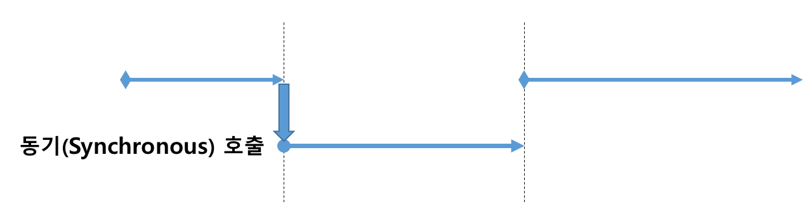
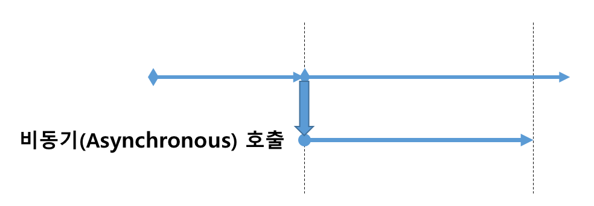
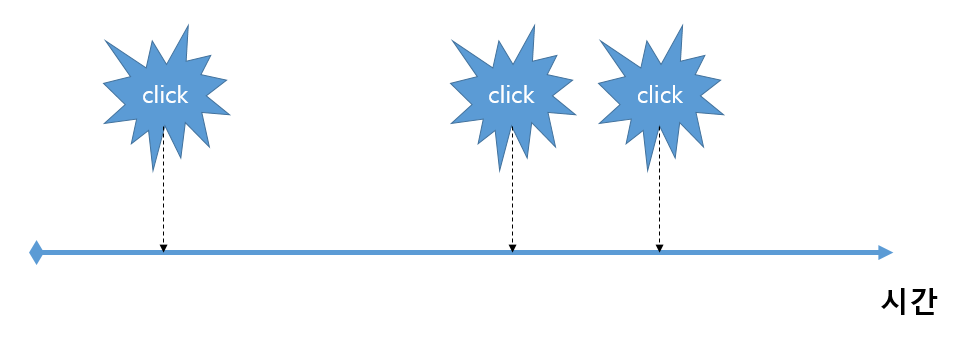
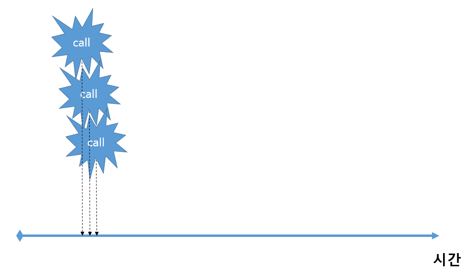
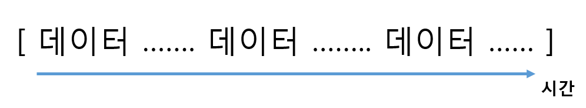
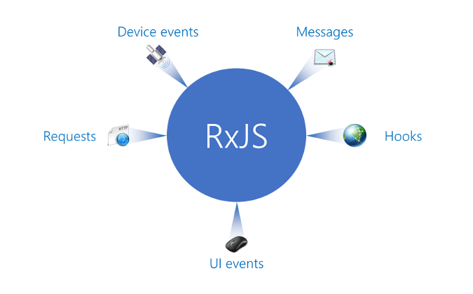

# RxJS가 해결하려고했던 문제1 - 입력 데이터의 오류

1부에서는 RxJS의 본질을 알아가기 위한 과정을 기술한다.
RxJS가 안정적인 어플리케이션을 만들기 위한 `범용적인 데이터 플로우 솔루션`이라는 의미를 하나씩 확인해보도록 하자.

그 첫번째로, 입력 오류에 관한 고민에 대한 이야기이다.
RxJS는 입력 오류 중 어느 부분을 개선하고자 했고, 또 그것을 어떻게 개선하려고 했는지 살펴보자.

## 웹어플리케이션의 입력 데이터
웹어플리케이션의 동작 과정을 되돌아보면 사실 몇 개의 큰 과정으로 나눌 수 있다.

간단한 게시판을 예로 생각해보자.
게시판은 서버에 저장된 글을 보여주는 목록화면과 게시글의 내용을 보여주는 상세화면으로 구성되어 있다.
서버로부터 저장된 글에 대한 정보를 받고, 받은 정보를 바탕으로 화면과 관련된 UI작업을 한다.
게시글의 종류나 카테고리를 셀렉트 박스로 표현할 수도 있고, 작성된 글의 내용 일부를 화면에 표현하기도 한다.

또한 사용자가 게시글을 등록. 수정하는 편집화면도 있다. 편집화면에서는 사용자가 셀렉트 박스를 선택하기도 하고, 글을 입력하기도 한다. 사용자의 입력이 잘못된 경우에는 사용자에게 메시지를 전달하기도 하기도 한다.
글의 작성 및 수정이 끝나면 등록한 정보를 서버에 저장한다.

이 과정을 `데이터가 흐르는 관점`으로 살펴보면
- 1) 목록화면과 조회화면은 서버로부터 데이터를 불러와 브라우저에게 전달한다.
- 2) 브라우저에 전달된 정보를 브라우저의 UI객체에 전달한다.
- 3) 편집화면은 브라우저 UI객체를 통해 사용자 입력정보를 전달받고 이를 다시 브라우저의 다른 UI객체나 브라우저 객체에 전달한다.
- 4) 사용자가 작성한 정보를 브라우저 UI객체나 브라우저 객체를 이용하여 서버로 전달한다.

이 과정을 다시 `상태머신` 관점에서 살펴보자.  
1)과 2)의 과정에서 입력값은 `서버로부터 전달 받은 게시글 데이터`가 된다. 두 과정의 입력값이 동일 할지라도 입력값을 받는 브라우저와 브라우저 UI 객체는 `서로 다른 시점`에 입력값을 전달받는다.
예를 들어 1)과정이 Ajax로 JSON 데이터를 받아와 브라우저의 객체로 저장하는 경우라면 Ajax는 비동기(Asynchronous) 호출로 데이터를 받기 까지 시간이 걸린다.
```js
// XMLHttpRequest에 의해 입력된 데이터
let result;
const xhr = new XMLHttpRequest();
xhr.onload = function(e) {
  /*
   * Ajax를 통해 얻은 데이터를 result 변수에 저장한다.
   * 
   * {
   *   list: [
   *      "게시글1번. 안녕하세요.",
   *      "게시글2번. 반갑습니다.",
   *      "게시글3번. RxJS에 대해 알아봐요."
   *   ]
   * } 
   */
  result = JSON.parse(xhr.responseText);
}
xhr.open("GET", url);
xhr.send();
```
반면, 브라우저 UI객체는 이미 브라우저에 존재하는 JSON 데이터를 받기 때문에 동기(Synchronous) 호출로 바로 결과 데이터를 얻을수 있다.
```html
<ul>
  <li></li>
  <li></li>
  <li></li>
</ul>
```
```js
Array.from(document.querySelectorAll("li")).forEach((v, i) => {
  // Ajax의 결과인 result 변수를 이용하여 DOM에 정보를 표현한다.
  v.innerText = result.list[i];
});
```

마찬가지로 3)과 4)의 과정도 입력값은 `사용자의 입력`이 되지만, 전달된 입력값을 처리하는 시점은 상황에 따라 각각 다르다.

앞에서 설명한 내용을 간단히 정리하면 다음과 같다.

|과정| 데이터 | 데이터 흐름 | 전달 시점 |예제 |
|----|-------| -----------|--------| --------|
| 1) | 게시글 | 서버 -> 브라우저 | 비동기 | Ajax 통신으로 JSON 데이터를 받는다. |
| 2) | 게시글 | 브라우저 -> 브라우저 UI 객체 | 동기 | JSON 데이터를 UI에 반영한다. |
| 3) | 사용자가 입력한 내용 | 사용자 -> 브라우저 UI객체 | 비동기 | &lt;textarea&gt;를 통해 사용자 입력을 받는다.
| 4) | 사용자가 입력한 내용 | 브라우저 UI 객체 -> 브라우저 -> 서버 | 동기, 비동기 | &lt;textarea&gt;에 있는 데이터를 JSON 객체로 저장 후, 서버로 Ajax 요청을 한다|

## 입력 데이터의 전달 시점이 다양하다.
앞에서 살펴본 바와 같이 입력데이터가 같을지라도 실제 각 객체들 사이로 데이터가 전달되는 시점은 다르다. 어떤 상황에서는 동기(Synchronous) 방식으로 데이터를 주고 받고, 어떤 상황에서는 비동기(Asynchronous) 방식으로 데이터를 주고 받는다.
이런 구조는 비단 웹어플리케이션 뿐만이 아니다. 소프트웨어 전반적으로 이와 같은 상황이 발생한다.
이런 이유는 두 방식의 차이점을 살펴보면 보다 명확히 알수 있다.

### 동기(Synchronous)
동기방식은 작업이 들어온 순서에 맞게 차근차근 하나씩 진행되는 것을 의미한다. 호출하는 함수가 호출되는 함수의 작업 완료를 기다린 후 그 다음을 진행하는 방식이다. 이 방식의 장점은 순차적으로 진행되기 때문에 개발이 쉽다. 반면, 처리하는 작업이 많을 경우에는 전체 작업 속도가 느려진다. 특히, 웹브라우저와 같이 단일 UI쓰레드를 사용하는 경우에는 해당 작업이 끝날때까지 브라우저는 대기하고 있어야만 한다.
 

### 비동기(Asynchronous)
반면, 비동기 방식은 작업이 들어온 순서에 상관없이 산발적으로 진행되는 것을 의미한다. 호출하는 함수가 호출되는 함수의 작업 완료를 기다리지 않고, 그 다음을 진행하고 호출되는 함수의 작업이 완료되면 별도의 이벤트나 callback 함수를 통해 결과를 전달하는 방식이다. 이 방식의 장점은 효과적으로 작업을 진행할 수 있다는 점이다. 설사 먼저 실행된 작업의 처리시간이 오래걸리더라도 다른 작업을 진행할 수 있다. 반면, 개발은 더욱 복잡해지고 오류 확률은 높아질 우려가 있다.



## RxJS는 어떻게 개선하였나?
RxJS가 주목했던 부분은 바로 이 입력 데이터에 대한 구조적 문제를 개선하고자 하였다.
모든 처리가 동기(Synchronous) 호출 방식이라면 개발은 쉽고, 오류 발생 빈도는 낮아질 것이다. 하지만, 효과적으로 작업을 처리하기 위해서는 상황에 따라 동기와 비동기 개발방식을 혼재하여 사용해야만 한다.
사실 브라우저에서 제공하는 API자체가 동기 또는 비동기 방식이기 때문에 본질적으로 우리는 이 문제를 피해갈수가 없다.

RxJS는 이런 구조적인 문제를 개선하기 위해 `단 하나의 방식`을 사용할수 있는 구조를 제공한다. 이런 구조의 일원화는 개발을 단순화시킨다. 이런 단순화는 결국에는 오류 발생 빈도를 낮추고, 생산성 향상을 도와준다. 

RxJS는 동기(Synchronous)와 비동기(Asynchronous)의 차이점을 `시간`이라는 변수를 도입함으로써 해결하려고했다.
대표적인 비동기(Asynchronous) 처리방식인 이벤트(Event)를 살펴보자.
Button에서 발생하는 click 이벤트를 처리하기 위해서는 다음과 같이 버튼에 이벤트 핸들러를 등록한다. 
```js
button.addEventListener("click", event => {
  // @todo
});
```
한번 이벤트 핸들러가 등록되면 사용자가 버튼을 눌렀을 때마다 등록된 이벤트 핸들러가 호출된다.
이런 과정에 `시간`이라는 변수를 도입함으로써 우리는 다른 시각을 얻을 수 있다.  

버튼을 누르는 행위가 우리가 원하는 데이터라면 시간 축을 기준으로 이 데이터는 다음과 같은 모습을 보일 것이다.



이벤트가 아닌 동기(Synchronous) 방식인 함수호출도 `시간`이라는 변수를 도입하면 다음과 같이 표현될 수 있다.



결국 동기와 비동기는 시간의 축으로 봤을때는 같은 형태인 것이다.
또한, 이런 형태는 `시간을 인덱스로 둔 컬렉션`으로 생각할 수도 있다. RxJS에서는 이를 `스트림(Stream)`이라 표현한다.



RxJS에서는 이런 Stream을 표현하는 `Observable` 클래스를 제공한다. 


## Observable
Observable은 `시간을 인덱스로 둔 컬렉션을 추상화한 클래스`이다.
이 클래스는 동기나 비동기의 동작 방식으로 전달된 데이터를 `하나의 컬렉션`으로 바라볼 수 있게 해준다.
이렇게 함으로써 개발자는 데이터가 어떤 형태로 전달되는지에 대해 고민할 필요가 없어진다.
단지, Observable을 통해 데이터를 전달 받기만 하면 된다.

> ##### Observable의 표준화
> RxJS의 Observable은 Rx에서 만든 라이브러리이기도 하지만, ECMAScript에 표준으로 제안된 스펙이기도하다. 
> https://github.com/tc39/proposal-observable
>
> 이 책에서 다루는 RxJS5는 ECMAScript에 제안된 표준 스펙을 기반으로 작성된 라이브러리이다.


## RxJS는 Observable이라는 객체를 제공한다.

### Observable의 특징
RxJS는 Observable로 생성된 데이터를 바탕으로 모든 일을 하기 때문에, RxJS에서 가장 중요한 클래스이자 가장 핵심이 되는 클래스이다. Observable의 특징에 대해 딱 2가지만 살펴보자.
그 외의 특징은 이 책을 통해 차차 알아가기로 하자.

#### 1. 모든 데이터는 Observable로 만들 수 있다.
Observble은 모든 데이터를 다룬다.

- 키보드를 눌러서 입력된 데이터
- 마우스를 이동하거나 클릭해서 입력된 데이터
- Ajax/fetch 요청을 통해 얻은 데이터
- Web socket을 통해 전달된 데이터
- Message를 통해 전달된 데이터
- ...



Rx.Observable 클래스를 이용하면 이런 모든 데이터들은 Observable로 만들수 있다. 이렇게 함으로써 `동기든 비동기든 모든 데이터 타입을 동일한 형태로 사용할 수 있다.`
Rx.Observable은 Observable을 만들기 위해 다양한 static 메소드를 제공한다.

키보드나 마우스와 같은 Event를 Observable로 만들때는 `Rx.Observable.fromEvent`를 이용한다.
> Rx.Observable.fromEvent(HTMLElement, "이벤트타입");
```js
const key$ = Rx.Observable.fromEvent(document, "keydown");
const click$ = Rx.Observable.fromEvent(document, "click");
```

배열 같은 iterable 이나 array-like 데이터를 Observable로 만들 때에는 `Rx.Observable.from`을 이용한다.
> Rx.Observable.from(Iterable|Array-like);
```js
const arrayFrom$ = Rx.Observable.from([10, 20, 30]);
const iterableFrom$ = Rx.Observable.from(new Map([[1, 2], [2, 4], [4, 8]]));

function fn() {
  const argumentsFrom$ = Rx.Observable.from(arguments);
}
```

Promise를 Observable로 만들 때에는 `Rx.Observable.fromPromise`를 이용한다. 
> Rx.Observable.fromPromise(promise)

```js
const ajaxFromPromise$ = Rx.Observable.fromPromise(fetch("./api/some.json"));
```

단일 데이터를 연속으로 전달하는 경우에는 `Rx.Observable.of`를 이용한다.
> Rx.Observable.of(...items);
```js
const numberOf$ = Rx.Observable.of(10, 20, 30);
const stringOf$ = Rx.Observable.of("a", "b", "c");
```

위에서 언급한 모든 static 메소드는 `Rx.Observable.create`를 이용하여 만든 팩토리 메소드이다. Rx.Observable.create는 Rx.Observable 생성자의 별칭이기도 하다.
이 메소드의 쓰임새에 대해서는 자세한 예제는 2부에서 살펴보기로 하자.

> #### Observable 객체의 변수명은 접미사로 $를 붙인다.
> Observable 객체는 stream이다. 따라서, 관용적으로 Stream을 뜻하는 S와 유사한 $를 Stream의 약어로 사용한다.  
> 예) clickStream => click$


#### 2. Observable은 기본적으로 Lazy하다.
Lazy에 대한 이해부터 해보자.
Lazy는 사전적으로 `게으른, 느긋한, 여유로운` 이란 뜻이지만, 컴퓨터에서는 지연을 시키는 방법의 하나로 표현한다. 비슷한 경우로 함수를 예로 들어보자.
우리가 `foo`라는 함수를 사용하고자 한다면, 먼저 `foo`라는 함수를 정의해야만 한다.
```js
functon foo(mustHave) {
  console.log(`I'am lazy ${mustHave}`);
}
```

그리고 실제 함수를 사용하고자 할때 다음과 같이 `호출`이라는 과정을 거친다.
```js
foo(afterAjaxResult);
```

이때, 넘겨주어야할 파라미터(afterAjaxResult)가 존재하지 않거나, 아직 준비되지 않았다면 준비가 될때까지 함수 호출을 지연해야만 한다.
이렇게 함수는 개발자가 원하는 시점을 제어할 수 있는 통제권을 주는 장점이 있다.

마찬가지로 Observable도 전달 받고자하는 데이터의 컬렉션이기 때문에, 우리가 준비가 된 상황에 데이터를 전달 받을 수 있어야만 한다. 
함수의 호출과정은 Observable 객체의 `subscribe`를 호출하는 행위와 같다.

Observable은 기본적으로 `subscribe`가 호출될때 실제 우리가 전달 받고자 하는 데이터를 전달하기 시작한다.

```js
// Observable에서 click 이벤트가 전달되지 않는다.
const clicks$ = Rx.Observable.fromEvent(document, 'click');

// subscribe가 호출되는 순간 부터 click 이벤트가 전달된다.
clicks$.subscribe(event => console.log(event));
```

> #### RxJS가 제공하는 Observable 형태
> RxJS의 Observable은 2가지 형태를 제공한다. subscribe가 호출되기 전까지 데이터를 전달하지 않는 Observable를 RxJS에서는 `Cold Observable`이라고 부른다. 반면, Observable 객체의 생성과 동시에 데이터가 전달되는 Observable을 `Hot Observable`이라고 한다. 기본적으로 우리가 만드는 대다수의 Observable은 Cold Observable이다.

## 정리
이 장에서는 웹어플리케이션의 입력 데이터가 어떻게 전달되는지를 살펴 봄으로써 입력데이터 전달 방식의 구조적 문제점을 살펴보았다.
RxJS는 이 문제를 `시간을 인덱스로 둔 컬렉션`으로 추상화시킴으로서 동기와 비동기 입력데이터를 `하나의 컬렉션`으로 생각할수 있게 하였다. 이를 Stream이라 부르며, 그 구현체가 Observable 클래스이다.
모든 데이터는 Observable로 표현될 수 있고, Observable은 함수와 같이 Lazy한 특성을 가진 객체라는 것을 알았다.

다음장에서는 RxJS가 고민한 상태 전달 오류에 대해 살펴보기로 하자.
