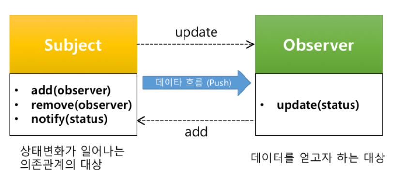
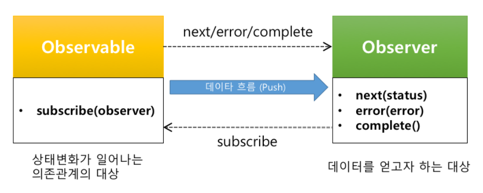
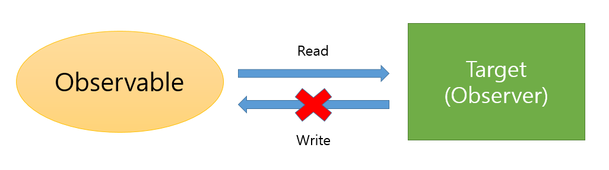
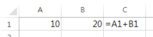

# RxJS가 해결하려고했던 문제2 - 상태 전파 문제

이번 장은 상태 머신에서 가장 흔하게 발생하는 상태 전파(State Propagation)에 대한 이야기이다.

RxJS가 상태 전파에 대한 문제를 어떻게 접근했고, 이를 어떻게 해결하려고 했는지 이 장을 통해 살펴보자.


## 웹어플리케이션의 상태
우리가 만드는 웹어플리케이션은 하나의 큰 상태 머신이고 이를 구성하고 있는 크고 작은 단위들 또한 하나의 상태머신이다.
각각의 상태 머신들은 각자의 상태를 가지고 있고, 상태 머신들은 각자의 역할에 따라 서로 유기적으로 연결되어 있다.  

A라는 작은 상태 머신의 상태값은 B의 입력값이 될수 있고, B의 상태값은 C와 D에 관련 있는 상태값 일수 있다.
따라서, A의 상태 값은 B로 전달되어야하고 B의 상태값은 다시 C와 D에 전달되어야만 한다.
이렇게 A의 상태 변화 정보가 B에 전달되어야하고 B의 상태값이 다시 C와 D에 전달되어야하는 이유는 바로 A, B, C, D 모듈간에 `의존성`이 있기 때문이다.

간단한 예를 들어보자.
사용자 정보(상태)를 System 클래스가 check() 함수에서 사용하고 있는 예제이다.
System과 User간에는 다음과 같은 의존성이 존재한다.


```js
class User {
    constructor() {
        this._state = {
            name: "손찬욱",
            isLogin: false
        };
    }
    getName() {
        return this._state.name;
    }
    isLogin() {
        return this._state.isLogin;
    }
    login(name) {
        this._state.name = name;
        this._state.isLogin = true;
    }
    logout() {
        this._state.name = "";
        this._state.isLogin = false;
    }    
}

class System {
    constructor(user) {
        this._token = null;
        this._id = "System";
        this._user = user;
    }
    check() {
        const username = this._user.getName();
        if (this._user.isLogin()) {
            this._token = [...username].reduce((acc, v) => acc + v.charCodeAt(0), 0);
            console.log(`[${this._id}] ${username} 의 토큰은 ${this._token} 입니다`);
        } else {
            this._token = null;
            console.log(`[${this._id}] 로그인 되지 않았습니다`);
        }
    }
}

let user = new User();
let system = new System(user);

// System 작업
system.check();  // [System] 로그인 되지 않았습니다

// User의 상태변화 발생
user.login("sculove");

// System 작업
system.check();  // [System] sculove 의 토큰은 769 입니다

// User의 상태변화 발생
user.logout();

// System 작업
system.check();  // [System] 로그인 되지 않았습니다
```

System은 User의 로그인 정보에 의해 System의 출력(상태)이 결정된다.


## 웹어플리케이션의 상태변화로 인한 문제점.
System과 User 코드는 굉장히 간단하면서도 훌륭한 예제이다. 하지만, 실프로젝트에서 사용된다면 많은 문제점이 발생할 수 있는 코드이다.

### 첫째, User의 인터페이스가 변경되면, System도 함께 변경을 해주어야한다.

System에서는 user의 메소드인 getName, isLogin을 사용하고 있다.

```js
class System {
    // ...
    check() {
        const username = this._user.getName();
        if (this._user.isLogin()) {
            // ...
        } else {
            // ...
        }
    }
}
```

위 코드는 작은 코드 조각이기 때문에, 크게 문제가 되지 않을수 있지만, 클래스의 크기가 커지면 커질수록 변경에 대한 영향도는 점점 커질 것이다.
뿐만 아니라, 지금은 System이 User를 사용하고 있는 상황이지만, 다른 클래스 A, B, C, ... 등이 모두 User에 의존도를 가지고 있을 경우에는 더욱 더 변경에 대한 영향도는 커질 것이다.

### 둘째, User 상태를 확인하기 위한 인터페이스에 대한 의사소통 비용이 발생한다.
User를 개발한 개발자와 User와 의존관계가 있는 class A, class B, class C,... 을 개발한 개발자 사이에는 의사소통에 따른 비용이 발생하게 된다.
지금은 User의 인터페이스가 getName, isLogin, login, logout 정도이지만, 인터페이스가 많아 질 경우 이에 대한 비용이 증가하게 될 것이다.

### 셋째, 다수의 클래스가 User에 의존 관계가 있는 경우라면, User의 변경여부를 반영하기 위해 다수의 클래스들이 직접 User의 상태를 모두 반영해야만 한다.
즉, 변경에 대한 전파가 원활하게 이루어지지 않는다.
이는 꽤나 번거로운 작업일 뿐만 아니라, User와 의존성이 있는 다수의 클래스들과의 의존 관계를 항상 염두에 두고 개발을 해야만 하기 때문에, 잦은 오류가 발생하기 쉽다.

```js
// User 상태변화 발생
user.login("sculove");

// User와 의존관계가 있는 classA
// User와 의존관계가 있는 classB
// User와 의존관계가 있는 classC
// User와 의존관계가 있는 classN ...
classA.process();
classB.process();
classC.process();
classN.process();
```

## 우리가 이미 알고 있는 솔루션 - Observer Pattern
앞에서 이야기했던 문제점은 이미 우리가 익히 알고 있는 패턴으로 대부분 해결이 가능하다.
바로 `Observer Pattern`이다.
자 그럼 Observer Pattern에 대해 잠시 살펴보자.

### Loosely Coupling
Observer Pattern에서는 상태가 변경될 대상을 Subject라고 한다. 그리고, 그 상태 변화를 관찰하는 대상을 Observer라고 한다.
Observer Pattern에서는 Subject와 Observer가 서로 느슨하게 연결되어 있다.
여기서 `느슨하게 연결되었다 (Loose Coupling)`는 의미는 Subject와 Observer가 서로 상호작용을 하지만, 서로 잘 모른다는 의미이다.
Subject가 Observer 에 대해서 아는 것은 Observer가 특정 인터페이스(update)를 구현한다는 것 뿐이다.
Observer는 언제든지 추가, 삭제할 수 있으며, 새로운 타입의 Observer를 추가하려고 해도 Subject를 변경할 필요가 전혀 없다.
또한, Subject와 Observer는 서로 독립적으로 사용이 가능하며, Observer 가 바뀌더라도 서로한테 영향을 미치지 않는다.

### 자동 상태 전파
기존 방식과 같이 데이터를 얻고자 하는 대상이 데이터를 직접 가져오는 방식은 매번 요청을 하여 변경 사항을 확인해야만 한다.
하지만 Observer Pattern은 이와 다르게 의존 관계의 대상(Subject)으로 부터 데이터를 제공 받는 방식이다.
전자의 경우를 `Pull` 방식이라고 후자를 `Push` 방식이라고 한다.


Push 방식은 Pull 방식에 비해 상태 전파 문제를 효과적으로 처리 할 수 있다.
Push 방식으로 구성된 Observer Pattern은 Subject의 상태가 변경되었을 경우 관찰하는 Observer에게 자동으로 알려준다. 특히, Subject와 Observer가 1:n의 상황에서는 더욱 유효하다.
다수의 Observer를 Subject에 등록하기만하면 Subject의 변경사항이 등록된 다수의 Observer에게 자동으로 전달된다.
개발자는 데이터 변경 시점을 매번 확인할 필요도 없고 신경쓸 필요도 없다. 단지 변경되었다는 신호가 왔을 경우 처리만 해주면된다.


### 인터페이스의 단일화
앞에서 살펴본 바와 같이 인터페이스가 있다는 것은 많은 비용을 수반한다. 인터페이스가 증가 할때마다 개발자간의 의사소통 비용이 증가하고 변경 영향도도 커진다.
사실 이 문제는 인터페이스를 줄이는 것 만으로도 비용을 줄일 수 있다. 하지만 더욱 좋은 방법은 인터페이스가 있어도 없게 만드는 것이다. 어려운 이야기지만 사실 간단하다. `인터페이스를 특정 몇개로 통일하는 것이다.`
모든 객체가 쓰는 인터페이스는 methodA, methodB, methodC 이다라고 정의하면 서로의 의사소통 비용이 줄어든다. 더불어, 변경사항이 생기더라도 영향도는 기존 보다 훨씬 작아진다.
Observer Pattern은 `Observer.update`만 존재하기 때문에 Subject에서는 Observer 인터페이스에 대한 별도의 비용이 존재하지 않는다.

## Observer Pattern의 흔한 예
실제 Observer Pattern으로 작성된 예제를 통해 Observer Pattern을 이해해보자.
이런 Observer pattern의 가장 흔한 예로는 뉴스를 발행하는 신문사와 이를 구독하는 고객들이 있는 경우가 있다.

뉴스를 발행하는 신문사(Subject)는 고객들(Observer)를 등록하고, 신문이 발행될 때, 각각의 고객들에게 신문이 발행되었다고 알려준다.(notify)
각 고객들은 신문이 발행되었을때, 어떤 고객은 뉴스를 스크랩하거나, 어떤 고객은 뉴스를 읽기 시작한다.

이를 다이어그램으로 표현하면 다음과 같다.




이제 간단하게 코드로 작성해보자.

뉴스 정보를 저장하는 클래스를 작성해보자. 이 클래스는 뉴스 정보를 변경할 수 있는 setNews() 메소드를 제공한다.

```js
class NewsPaper {
    setNews(news) {
    }
}
```

NewsPaper 클래스를 Subject 역할을 할수 있도록 구현해보자.
각각의 Observer를 등록, 삭제 할수 있는 add, remove 메소드를 추가하고, 
상태 변경이 일어났을 때 각각 Observer의 update 메소드를 호출하는 notify 메소드를 추가하자.

```js
class NewsPaper {
    constructor() {
        this._observers = [];
    }
    setNews(news) {
        this.notify(news);
    }
    add(observer) {
        this._observers.push(observer);
    }
    remove(observer) {
        let idx = this._observers.indexOf(observer);
        if (idx !== -1) {
            this._observers.splice(idx,1);
        }
    },
    notify(news) {
        this._observers.forEach( v => {
            v.update(news);
        });
    }
}
```

이제는 뉴스를 구독하고자 하는 각각의 NewsScrapper와 NewsReader Obsever를 만들어보자.

```js
class NewsScrapper {
    update(news) {
        console.log(`뉴스를 스크랩하자 - ${news}`);
    }
};

class NewsReader {
    update(news) {
        console.log(`뉴스를 읽자 - ${news}`);
    }
}
```

자 이제 Observer Pattern을 이용하여 Subject와 Observer들을 만들어 보았다.
잘 동작하는지 확인해보자.

NewsPaper에 구독을 원하는 Observer(NewsScrapper, NewsReader)를 등록하고 NewsPaper의 setNews()를 통해 뉴스의 내용을 변경해보자.

```js
let newsPaper = new NewsPaper();

// 구독하기
newsPaper.add(new NewsScrapper());
newsPaper.add(new NewsReader());

// 상태 변경
newsPaper.setNews("북한 미사일 발사!!!");
newsPaper.setNews("코스피 최저점 이탈!!!");
newsPaper.setNews("남북평화회담 성사");
newsPaper.setNews("남북통일");
```
새로운 뉴스가 구독자들에게 잘 전달이 되는가?

```
뉴스를 스크랩하자 - 북한 미사일 발사!!!
뉴스를 읽자 - 북한 미사일 발사!!!
뉴스를 스크랩하자 - 코스피 최저점 이탈!!!
뉴스를 읽자 - 코스피 최저점 이탈!!!
뉴스를 스크랩하자 - 남북평화회담 성사
뉴스를 읽자 - 남북평화회담 성사
뉴스를 스크랩하자 - 남북통일
뉴스를 읽자 - 남북통일
```

상태 변경이 잘 전파되고 있다.
좋다. 

## Observer 패턴 적용 하기
Observer 패턴을 우리가 고민했던 문제의 예제에 적용해보자.
상태 변화를 관찰할 User를 Subject로 만들고, System을 Observer로 변경해보자.

Subject는 각각의 Observer를 관리하는 기능 자제가 별도로 존재하기 때문에, 이를 상위 클래스로 만들고,
User를 하위 클래스로 변경해보자.

User의 상위 클래스로 사용될 Subject를 만들어보자.

```js
class Subject {
    constructor() {
        this._observers = [];
    }
    add(observer) {
        this._observers.push(observer);
    }
    remove(observer) {
        let idx = this._observers.indexOf(observer);
        if (idx !== -1) {
            this._observers.splice(idx,1);
        }
    }
    notify(status) {
        this._observers.forEach( v => {
            v.update(status);
        });
    }
}
```

Subject를 User의 부모 클래스로 지정하고, Observer인 System은 User와의 의존 관계를 제거 한다.
check 메소드는 Subject로 부터 데이터를 전달받을 상태정보(status)를 파라미터로 받고, 메소드명을 update로 변경한다.

```js
class User extends Subject {
    constructor() {
        this._state = {
            name: "손찬욱",
            isLogin: false
        };
    },
    getName() {
        return this._state.name;
    },
    isLogin() {
        return this._state.isLogin;
    },
    login(name) {
        this._state.name = name;
        this._state.isLogin = true;
        this.notify(this._state);
    },
    logout() {
        this._state.name = "";
        this._state.isLogin = false;
        this.notify(this._state);
    }    
}

class System {
    constructor() {
        this._token = null;
        this._id = "System";
    },
    update(status) {
        if (status.isLogin) {
            this._token = Array.prototype.reduce.call(
                status.username,
                (acc, v) => acc + v.charCodeAt(0), 0);
            console.log(`[${this._id}] ${status.username} 의 토큰은 ${this._token} 입니다`);
        } else {
            this._token = null;
            console.log(`[${this._id}] ${status.username} 은(는) 로그인 되지 않았습니다`);
        }
    }
}

let user = new User();
let system = new System();

user.add(system);

// User의 상태변화 발생
user.login("sculove");
user.logout();
user.login("crazymonlong");
```

System은 생성자에서 더이상 User의 인스턴스를 받지 않는다. 기존에 비해 의존성은 느슨해졌고 변경 상태도 의존성을 가진 모든 객체에 즉시 전파가 된다.

Login 클래스에 생성자의 파라미터로 구분자를 받는다면, 다수의 Login 모듈을 User에 등록하여 사용할 수도 있다.
```js
class System {
    // ...
    constructor(id) {
        this._id = id;
    }
    // ...
}
```

이제는 User의 add를 통해 등록만 하면, User의 상태 변화를 모두 감지할 수 있다.

```js
let user = new User();
let observer1 = new System("observer1");
let observer2 = new System("observer2");
let observer3 = new System("observer3");

user.add(observer1);
user.add(observer2);
user.add(observer3);
```

변경에 대한 인터페이스도 `update` 하나로 간결해졌다.


## RxJS는 무엇을 해결하고자 했는가?

RxJS는 상태 변화에 대한 문제를 Observer Pattern을 기반으로 해결하려고 하였다. 다만 기존 Observer Pattern에서 아쉬웠던 몇가지를 개선하였다.
앞에서 살펴본 `신문사와 구독자`의 예를 기준으로 살펴보자.

### RxJS가 개선하려고했던 Observer Pattern

#### 1. 상태 변화는 언제 종료되는가?

만약, 뉴스 서비스 종료로 더이상 뉴스를 전달하지 않게 되었다면 우리는 어떻게 구독자들(NewsScrapper, NewsReader)에게 이 내용을 전달할 수 있을까?
아마 다음과 같이 `뉴스서비스 종료`라는 특정 문자를 각 구독자들에게 보내고,
구독자는 `뉴스서비스 종료`라는 상태가 전달이 되면 `구독이 중지되었다`고 생각하고 별도의 처리를 해야만 한다.

```js
class NewsScrapper {
    update(news) {
        if(news === "뉴스서비스 종료") {
            console.log("뉴스 스크랩 서비스가 종료되었음");
        } else {
            console.log(`뉴스를 스크랩하자 - ${news}`);
        }
    }
};

class NewsReader {
    update(news) {
        if(news === "뉴스서비스 종료") {
            console.log("뉴스 읽는 서비스가 종료되었음");
        } else {
            console.log(`뉴스를 읽자 - ${news}`);
        }
    }
}

// NewsScrapper 구독
newsPaper.add(new NewsScrapper());
// NewsReader 구독
newsPaper.add(new NewsReader());

// 상태 변경
newsPaper.setNews("북한 미사일 발사!!!");
//...

// 종료시
newsPaper.setNews("뉴스서비스 종료");
```

이는 우리가 처음에 고민했던, 의사소통 비용에 대한 문제를 완벽하게 해결하지 못한 경우라고 이야기할 수 있다.
Observer Pattern은 상태를 전달하는 Subject의 데이터가 언제 종료되는지를 Observer들은 알 수가 없다.
이를 해결하기 위해서는 위와 같이 Observer와 Subject간에 별도의 규칙을 정해야만 한다. 결국 우린 또 다른 의사소통 비용을 쏟아야만하고, 결국 이런 의사소통의 산출물로 코드에 if문을 만들어야만 한다.
개발자로서 꽤 찝찝하고, 아쉬운 부분이다.

#### 2. 상태 변화에서 에러가 발생하면?
프로그램에서 기능이 정상 동작하는 경우가 대다수이지만 꼭 고민해야할 부분 중의 하나가 바로 에러 처리이다.
프로그래머가 예측한 경우에 대한 에러 일수도 있고 예측 불가능한 에러 일 수도 있다.
하지만, 분명한 것은 우리가 개발한 서비스는 항상 정상적인 상황에서 돌아가지만은 않는다는 것이다.

NewsPaper의 setNews 메소드에서 다음과 같이 에러가 발생하게 되면 어떻게 될까?

```js
setNews(news) {
    throw new Error("NewsPaper Error"); // 에러 발생.

    this.notify(news);
}
```
우선, Subject 자체적으로 에러처리를 할 수 있다.  
try-catch 문을 사용하면, 에러 발생 시 다시 한번 상태 변경을 시도 하거나, 상태 변경 작업 자체를 무시하는 등의 작업을 할 수 있다.

```js
setNews(news) {
    try {
        throw new Error("NewsPaper Error"); // 에러 발생.

        this.notify(news);
    } catch(e) {
        // 다시 시도~!
        this.notify(news);
    }
}
```

위와 같이 Subject 쪽에서 에러에 대한 처리를 별도로 하면, 등록된 Observer들은 상태 변경시 에러가 발생했는지 정상 동작했는지 모른다. 물론, 이 방법도 좋다.  
하지만, 경우에 따라서는 등록된 Observer 쪽에서 에러 발생 여부를 인지하고, 이에 대한 별도의 처리를 해야하는 경우가 필요하다.
Observer 패턴은 update 인터페이스만을 통해서 Subject의 상태를 Observer에게 전달하기 때문에, 이 상황을 처리하기에는 어렵다.
아쉽지만, Observer 패턴은 에러 발생 여부를 Observer들에게 전달할 방법이 딱히 없다.

#### 3. Observer에 의해 Subject의 상태가 변경되는 경우는?
신문사 기자이면서 동시에 구독자인 사람이 있는 경우라면 어떻게 될까?
만약 이 기자가 구독받은 기사의 내용을 조금 변경하여 다시 뉴스를 만드는 기레기 기자라면 우리는 생각보다 심각한 상황에 빠지게 된다.

```js
class WriterAndReader {
    constructor(newsPaper) {
        this._newPaper = newsPaper;
    }
    update(news) {
        console.log(`전달 받은 뉴스 - ${news}`);
        this._newPaper.setNews(`변형된 뉴스 - ${news}`);
    }
};

// WriterAndReader 구독
newsPaper.add(new WriterAndReader(newsPaper));

// 상태 변경
newsPaper.setNews("북한 미사일 발사!!!");
```

뉴스는 계속 반복적으로 생성되어 결국 브라우저는 뻗게 될 것이다.
이와 같이 Subject를 관찰하는 Observer가 Subject의 상태를 변경하는 경우에는 우리가 예상하지 못하는 복잡한 상황에 직면하게 될 수 있다.
이 예는 다소 과한 면이 있지만 우리가 프로그램을 하다보면 이렇게 데이터가 양방향으로 흐르게하는 경우가 종종 있다.
데이터의 흐름이 양방향으로 흐르게 함으로써 편한 면도 있지만 궁극적으로는 코드의 복잡도를 증가시키는 경우가 많다.

## RxJS는 어떻게 개선하였나?
RxJS 역시 Observer 패턴으로 상태 전달 문제를 해결하려고 하였다.

우선 RxJS에 녹아 있는 Observer 패턴을 살펴보자.
RxJS에서 전달되는 데이터는 모두 Observable 형태로 반환된다.
Observable은 `subscribe` 과정 후부터 데이터를 전달받기 시작한다.
```js
const click$ = Rx.Observable.fromEvent(document, "click");
click$.subscribe(function(v) {
    console.log(v);
});

// 또는
click$.subscribe({
    next: function(v) {
        console.log(v);
    }
});
```

반면, Observer 패턴에서는 Subject와 Observer가 `add` 과정 후 부터 데이터를 전달받기 시작한다.
```js
let newsPaper = new Subject();
newsPaper.add({
    update: function(v) {
        console.log(v);
    }
});
```

둘의 관계는 닮았다.
RxJS의 Observable은 Observer 패턴의 Suject와 닮았다. Observer는 RxJS에도 있고 Observer 패턴에서도 있다. 차이가 있다면 Observer 패턴의 Observer는 객체로 add라는 메소드를 통해 전달되고, RxJS의 Observer는 함수와 객체 둘다 가능하며 subscribe라는 메소드를 통해 전달된다.
이런 차이가 발생하게 된 배경은 RxJS가 기존 Observer 패턴의 아쉬웠던 점을 개선하고자 했기 때문이다.
RxJS가 개선한 Observer 패턴에 대해 살펴보도록 하자.

> #### RxJS의 Observable과 Subject
> RxJS에는 Observable도 있고 Subject도 있다. RxJS의 Subject는 기능적으로 정확히 Observer 패턴의 Subject와 일치한다. 다수의 Observer에게 공통의 데이터를 전달하고 update와 같은 메소드가 존재하여 데이터의 변경도 가능하다. 
> 반면 RxJS의 Observable은 기능적으로 Observer 패턴의 Subject와는 엄격히 다르다. Observable은 단지 하나의 Observer에게 독립적인 데이터를 전달한다.
> 이 장에서는 `상태 전달 형태와 구조적인` 측면에서 Observer 패턴의 Subject가 RxJS의 Observable과 닮았다는 의미로 사용 하였다.
> 이에 대한 자세한 내용을 2부 Subject를 다루는 "자동완성 UI 만들기 more" 장에서 자세히 살펴보기로 하자.

### RxJS가 개선한 Observer Pattern

#### 인터페이스의 확장
1장에서 살펴본 바와 같이 RxJS는 시간의 축으로 데이터를 보기 때문에 데이터의 연속적인 변화를 Observer에서 표현할수 있도록 기존 `update 메소드를 next로 바꾸었다.`
또한 Observer 패턴은 종료시점, 에러시점에 대한 인터페이스가 존재하지 않기 때문에, 종료를 나타내는 `complete 메소드와 에러시점을 나타내는 error 메소드를 추가`하였다.



즉, Observer패턴에서는 하나의 메소드를 갖는 Observer를 사용하였다면 RxJS의 Observer는 next, complete, error의 3개 메소드를 갖는다. 그런데 객체가 아닌 왜 함수를 사용하는 것인가?
물론, Observable.subscribe는 다음과 같이 객체, 함수 모든 형태로든 다 전달 받을 수 있다.

```js
const numbers$ = Rx.Observable.of([1,2,3,4,5,6,7,8]);

// next, error, complete가 있는 객체를 받음
numbers$.subscribe({
    next(v) {
        console.log(v);
    },
    error(e) {
        console.error(e);
    },
    complete() {
        console.log("complete");
    }
});

// next 함수만 받음
numbers$.subscribe(v => {
    console.log(v);
});

// next, error 함수만 받음
numbers$.subscribe(v => {
    console.log(v);
}, e => {
    console.error(e);
});

// next, error, complete 함수를 받음
numbers$.subscribe(v => {
    console.log(v);
}, e => {
    console.error(e);
}, () => {
    console.log("complete");
});
```

하지만, RxJS의 subscribe는 특별한 경우를 제외하고는 가급적 함수 형태를 사용한다.
그 이유는 객체는 상태를 가질 수 있기 때문이다.
객체가 상태를 가진다는 의미는 또 다른 상태 머신이 될 수 있다는 의미이기도 하다. 반면 함수는 상태가 존재하지 않는 기능만을 담당하기 때문에 상태에 관한 문제에서는 보다 자유롭다.
이와 관련된 내용은 3장에서 다룰 `로직 오류에 대한 문제`에서 다시 한번 다루도록 하겠다.

#### Observable은 Read-only
"기자이면서 구독자인 사례"와 같이 데이터가 양방향으로 흐르는 문제를 RxJS는 구조적으로 개선하려고 하였다.
Observable은 subscribe를 통해 데이터를 전달할 대상(Observer)에게 데이터를 전달할 수는 있지만, 반대로 전달할 대상(Observer)으로부터 데이터를 전달 받을 수는 없다. Observable은 데이터를 전달받는 그 어떤 메소드도 제공하지 않는다. Observable은 소스로부터 전달 받은 데이터를 Observer에게 전달하기만 한다. 즉, `데이터는 한 방향으로만 흐르게 된다`



이렇게한 근본적인 이유는 데이터 흐름을 단순화함으로 복잡도를 낮추고 오류 발생 빈도를 줄이기 위해서 이다.
물론, 데이터가 양방향으로 흐르게 되면 사용상 편리할 수는 있다. 하지만, 어플리케이션의 규모가 커지게 되면 양방향으로 흐르는 데이터의 복잡도는 통제하기 어려울 정도로 복잡해진다.

이러한 이유로 최근 등장한 프레임워크들은 모두 `단방향 데이터 흐름`을 지향한다.
> React와 Angular2+, Vue 모두 단방향 데이터 흐름을 지향한다. 


### Observable은 리액티브하다.
RxJS는 Observer 패턴과 마찬가지로 데이터가 발생하게되면 Observer에게 자동으로 그리고 빠르게 변경된 데이터를 전달한다.
이를 보고 `리액티브하다`고 이야기한다.
리액티브하다라는 의미를 이해하기 위해서는 우선 리액티브 프로그래밍(Reactive Programming)에 대한 정의 부터 살펴보자. 위키피디아에서는 다음과 같이 정의되어 있다.

> 리액티브 프로그래밍은 데이터 흐름과 상태 변화 전파에 중점을 둔 프로그램 패러다임이다. 사용되는 프로그래밍 언어에서 데이터 흐름을 쉽게 표현할 수 있어야하며 기본 실행 모델이 변경 사항을 데이터 흐름을 통해 자동으로 전파한다는 것을 의미한다.  
>
> 출처 : https://en.wikipedia.org/wiki/Reactive_programming

위 정의에서 가장 핵심이 되는 단어는 `데이터 흐름`과 `자동으로 전파`이다. 즉, 상태 변화의 흐름이 자동으로 전파되는 것을 `리액티브`하다고 이야기한다.

`리액티브`의 가장 흔하게 드는 예로 '엑셀'을 이야기할 수 있다.



A열의 값과 B열의 값의 합을 나타내는 C열은 A열이나 B열의 값이 변화되는 경우 자동으로 C열의 값이 변경된다.
이렇게 A나 B열의 변경사항이 데이터 흐름을 통해 자동으로 C열에 전파되도록 구조화하는 프로그래밍의 패러다임을 `리액티브 프로그래밍`이라고 한다.

이 말은 앞에서 살펴 보았던 상태 변화에 대한 우리의 고민들과 일맥 상통한다고 이야기할 수 있다.
이런 고민의 해결책이 Observer 패턴이고, RxJS는 이런 Observer 패턴을 개선하여 어플리케이션에서 발생하는 모든 데이터를 리액티브하게 전달 할 수 있게 해준다. 따라서, RxJS는 `리액티브 프로그래밍(Reactive Programming)`을 지향하는 라이브러리이다.

## 정리
이 장에서는 웹어플리케이션의 상태가 어떻게 전파되는지를 살펴 봄으로써 상태 전파로 인해 발생할 수 있는 문제점을 살펴보았다. 또한, 이러한 문제를 효과적으로 해결했던 Observer 패턴에 대해서도 살펴보았다.
Observer 패턴은 느슨하게 연결되어 Subject와 Observer간의 의존도를 줄였으며, Push 방식으로 데이터를 전파함으로써 상태 전파에 대한 많은 문제를 해결했다.
RxJS에서는 이런 Observer 패턴을 개선하여 상태 전파 문제를 해결하려고 하였다.
에러상황과 종료상황에 대한 인터페이스를 확장하였고, 데이터를 단방향으로 흐를 수 있도록 개선함으로써 코드의 복잡도를 낮추었다. 이런 결과 RxJS는 궁극적으로 Reactive Programming을 지향하는 라이브러리가 되었다.

다음장에서는 RxJS가 고민한 로직 오류에 대해 살펴보기로 하자.
