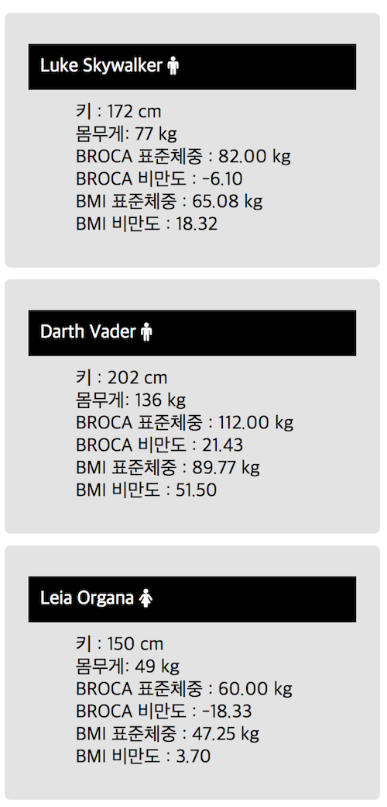
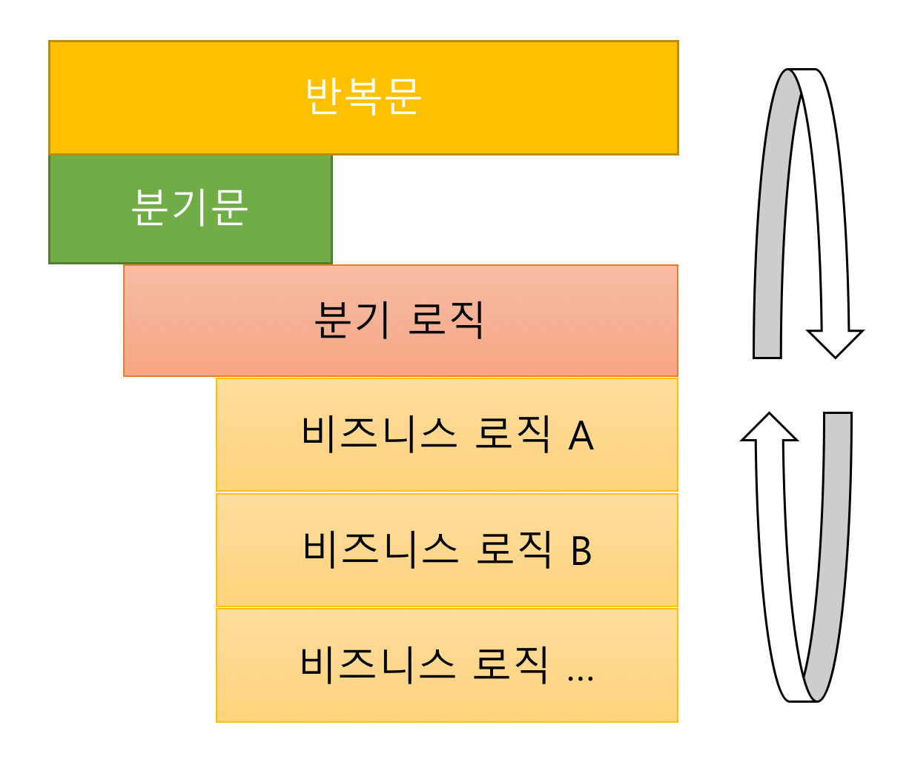
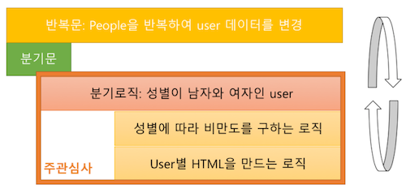
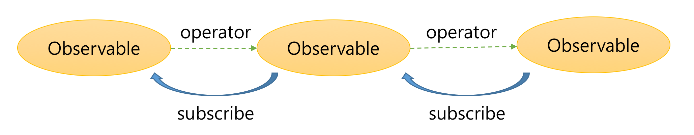
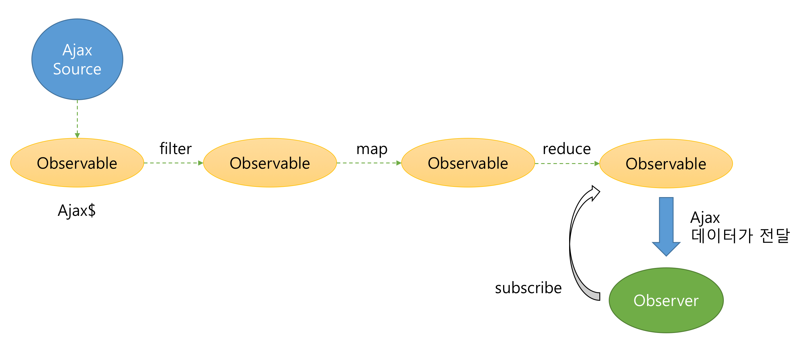

# RxJS가 해결하려고했던 문제3 - 로직 오류

이번 장은 `범용적인 데이터 플로우 솔루션`인 RxJS의 마지막 주제인 "로직 오류"에 대한 이야기 이다.
상태 머신의 로직 부분에서 오류가 발생하게 되는 이유를 살펴보고 RxJS는 어떤식으로 이 문제를 해결하려고 했는지 살펴보기로 하자.

### 웹어플리케이션의 로직
웹어플리케이션은 로직에 근거하여 전달받은 입력값을 이용하여 새로운 결과를 반환하거나 표현한다.
여기서 로직은 산술적인 로직이 될 수 있고 비즈니스적인 로직이 될수 있다. 또는 if문과 같이 간단한 프로그램의 흐름을 담당하는 부분일 수도 있다.

화면에 사용자 정보를 표현하는 UI 작성하는 예를 생각해보자. (예제에서 사용하는 API는 스타워즈 등장인물을 조회한다)  
DB로부터 조회한 사용자 목록 데이터가 입력값이라면 이 값을 바탕으로 우리는 다양한 처리를 한다.
- 성별이 "남"과 "여"인 사용자만 추출한다 (스타워즈 등장인물은 로봇과 같이 성별이 없는 사용자도 있다)
- 사용자의 이름, 키, 몸무게를 표시한다.
- 사용자의 성별에 맞게 아이콘을 화면에 표시한다.
- 사용자의 표준 체중을 계산하여 표시한다.
 > BROCA 방식
 > - 남자 표준체중 = (키 - 100) × 0.9  
 > - 여자 표준체중 = (키 - 105) × 0.9
 > 
 > BMI 방식
 > - 남자 표준체중 = 키/100 * 키/100 * 22
 > - 여자 표준체중 = 키/100 * 키/100 * 21

```js
const xhr = new XMLHttpRequest();
xhr.onreadystatechange = function() {
    if(xhr.readyState == 4 && xhr.status == 200) {
	const jsonData = JSON.parse(xhr.responseText);
        document.getElementById("users").innerHTML = process(jsonData);
    }
};
xhr.open("GET", "http://swapi.co/api/people/");
xhr.send();

// 데이터를 처리하는 함수
function process(people) {
    const html = [];
    for (const user of people.results) {
        if (/male|female/.test(user.gender)) {
	    let broca;
	    let bmi;
            if (user.gender == "male") {
		broca = (user.height - 100 * 0.9).toFixed(2);
		bmi = (user.height / 100 * user.height / 100 * 22).toFixed(2);
	    } else {
		broca = (user.height - 100 * 0.9).toFixed(2);
		bmi = (user.height / 100 * user.height / 100 * 21).toFixed(2);
	    }
	    const obesityUsingBroca = ((user.mass - broca) / broca * 100).toFixed(2);
	    const obesityUsingBmi = ((user.mass - bmi) / bmi * 100).toFixed(2);
			
	    html.push(`<li class='card'>
			  <dl>
			      <dt>${user.name} <i class="fa fa-${user.gender}"></i></dt>
			      <dd><span>키 : </span><span>${user.height} cm</span></dd>
			      <dd><span>몸무게: </span><span>${user.mass} kg</span></dd>
			      <dd><span>BROCA 표준체중 : </span><span>${broca} kg</span></dd>
			      <dd><span>BROCA 비만도 : ${obesityUsingBroca}</span></dd>
			      <dd><span>BMI 표준체중 : </span><span>${bmi} kg</span></dd>
			      <dd><span>BMI 비만도 : ${obesityUsingBmi}</span></dd>
			  </dl>
		      </li>`);
        }
    }
    return html.join("");
}
```



원래 조회했던 데이터는 온데 간데 없고 그 데이터로부터 생산된 새로운 정보들을 사용하고 있다.
위 예제는 사용자 체중과 키를 이용하여 성별에 따라 비만도 값을 계산하고 성별 아이콘을 화면에 표시한다.

우리는 알게 모르게 데이터를 추출하고 변환하는 작업을 빈번하게 하고 있다. 
복수 데이터를 처리하기 위해서는 반복문을 사용하고, 상황에 따라 데이터를 추출하거나 접근하기 위해서 분기문을 사용한다.
또한, 상황을 기억하거나 추출된 정보를 임시로 기억하기 위해서 변수를 사용한다. 

### 로직의 복잡성 그리고 오류
반복문과 분기문 그리고 변수는 우리 코드를 복잡하게 만든다. 반복문은 우리 코드의 가독성을 떨어뜨리고 분기문은 우리가 확인해야할 프로그램의 흐름을 여러 개로 만든다. 더군다나 우리가 기억해 놓은 변수의 값은 누군가에 의해 변경될 수 있다. 변수의 값이 변하면 우리가 의도했던대로 흐름으로 프로그램이 동작하지 않을 수 있다. 
이렇게 반복문과 분기문 그리고 변수는 우리 코드의 복잡도를 높이고 가독성을 떨어뜨리고, 결국에는 오류의 발생 빈도를 높인다.

#### 반복문과 분기문
로직의 복잡성을 줄이는 가장 간단한 방법으로는 기능을 쪼개는 것이다. 기능별로 쪼갠다는게 단순히 구역별로 쪼개게 되면 기능의 의미를 명확하게 드러내지 못한다. 더불어 이런 코드는 재사용성을 떨어뜨린다.

이렇게 기능을 쪼개는 일이 쉬운 일이 아닌 이유는 코드의 대다수는 다음과 같이 로직과 반복문, 분기문의 결합으로 구성되어 있기 때문이다. 



코드에서 반복문과 분기문을 모두 제거한다는 것은 사실상 불가능하다. 하지만 기능 단위로 분리 할 수 있다면 기능을 추상화 할 수 있고, 이로 인해 로직의 복잡성을 줄일 수 있다.

#### 변수는 오류의 시작
변수를 사용한다는 의미는 오류를 발생시킬 수 있는 확률을 높일 수 있다. 변수는 변경될 수 있는 값이기 때문에 유용하다. 반면, 의도치 않게 이 값이 바뀔 경우에 우리는 오류에 직면하게 된다.
브라우저 환경의 자바스크립트에서는 싱글 쓰레드 구조이기 때문에 Mutil Thread의 사용으로 인한 동시성 문제는 자주 발생하지 않는다. 하지만 DOM에 등록된 이벤트 핸들러로 인해 변수의 값이 변경되거나 비동기 행위로 인해 외부로 노출된 변수의 값들이 변경 될 수 있다.

> WebWorker와 같은 기술 스펙을 사용하면 Mutil Thread 기술을 사용할 수 있지만 브라우저는 기본적으로 하나의 메인 스레드에서 모든 작업이 이루어 진다.

따라서, 우리는 변수의 노출 범위를 제한하거나 제거함으로써 변수의 값이 외부에 의해 변경되지 않고 개발자의 의도에 따라 정확하게 변경될 수 있도록 보장하여만 한다.

### 자바스크립트의 솔루션
다행히도 자바스크립트는 이런 면에서는 꽤나 훌륭한 솔루션을 제공하고 있다.
함수형 프로그래밍의 특성을 가진 자바스크립트 함수를 이용하면 실제 로직과 상관이 없는 반복문, 분기문을 분리할 수 있다. 더불어 변수 또한 제거해 나갈 수 있다.
이렇게 함으로써 로직의 의미를 더욱 명확히 할 수 있으며 재사용성을 더욱 높일 수 있다.

> 자바스크립트 함수는 일급객체이다.  
일급 객체(First-class object)는 다음과 같은 특성을 가지고 있다. 
> - 변수 혹은 데이터 구조에 저장할 수 있다
> ```js
> var savedFunction = function() {};
> ```
> - 파라미터로 전달할 수 있다.
> ```js
> function foo(f, value) {};
> foo(function() {
>     console.log("함수를 파라미터로 전달 할 수 있다");
> }, "값");
> ```
> - 반환값으로 사용할 수 있다.
> ```js
> function foo() {
>    return function() {
>       console.log("함수를 반환할 수 있다");
>    };
> }
> ```

#### 로직의 분리
앞의 process 함수를 기능 단위의 로직과 반복문, 분기문으로 분리해보자.
process 함수는 다음과 같은 구조로 되어 있다.



여기에서 우리의 주요 관심사는 성별에 따라 비만도를 구하는 로직과 사용자별 HTML을 만드는 로직이다.
이 부분을 별도의 함수로 만들어보자.

표준 체중과 비만도를 계산하는 함수는 height, mass, gender을 입력값으로 받아서 BROCA와 BMI 방식의 비만도와 표준 체중을 반환한다.
```js
// 표준 체중과 비만도를 계산하는 함수
function logic(height, mass, gender) {
	let broca = (height - (gender === "male" ? 100 : 105)) * 0.9;
	let bmi = height / 100 * height / 100 * (gender === "male" ? 22 : 21);
	if (gender == "male") {
		broca = (height - 100 * 0.9).toFixed(2);
		bmi = (height / 100 * height / 100 * 22).toFixed(2);
	} else {
		broca = (height - 100 * 0.9).toFixed(2);
		bmi = (height / 100 * height / 100 * 21).toFixed(2);
	}
	const obesityUsingBroca = ((mass - broca) / broca * 100).toFixed(2);
	const obesityUsingBmi = ((mass - bmi) / bmi * 100).toFixed(2);
	return {
		broca,
		bmi,
		obesityUsingBroca,
		obesityUsingBmi
	};
}
```
사용자 정보별 HTML을 만드는 함수는 user 정보를 받아서 string 형태의 html을 반환한다.
```js
// 사용자 정보를 표현하기 위해 HTML을 만드는 함수
function makeHtml(user) {
	return `<li class='card'>
		<dl>
			<dt>${user.name} <i class="fa fa-${user.gender}"></i></dt>
			<dd><span>키 : </span><span>${user.height} cm</span></dd>
			<dd><span>몸무게: </span><span>${user.mass} kg</span></dd>
			<dd><span>BROCA 표준체중 : </span><span>${user.broca} kg</span></dd>
			<dd><span>BROCA 비만도 : ${user.obesityUsingBroca}</span></dd>
			<dd><span>BMI 표준체중 : </span><span>${user.bmi} kg</span></dd>
			<dd><span>BMI 비만도 : ${user.obesityUsingBmi}</span></dd>
		</dl>
	</li>`;
}
```
logic, makeHtml함수를 이용하면 다음과 같이 process 함수를 작성할 수 있다.
```js
function process(people) {
    const html = [];
    for (const user of people.results) {
        if (/male|female/.test(user.gender)) {
	    const result = logic(user.height, user.mass, user.gender);
	    Object.assign(user, result);
	    html.push(makeHtml(user));
        }
    }
    return html.join("");  
}
```
logic, makeHtml 함수를 만듦으로서 우리는 핵심 로직을 작성는데 집중할 수 있게 되었다.
더불어 logic, makeHtml 함수도 재사용 할 수 있는 단위 함수가 되었다.

#### 반복문, 분기문, 그리고 변수와의 이별
위에 개선한 process도 좋은 코드이다. 우리는 구현 로직에 더 집중할 수 있게 되었다.
하지만, 흐름을 제어하는 반복문과 분기문은 여전히 process에 존재한다. 
코드가 크면 클수록 process에 존재하는 반복문과 조건문은 우리 코드의 가독성을 떨어뜨릴 것이다. 더불어 html, result 같은 변수가 여전히 존재하기 때문에 우리는 항상 오류에 노출될 것이다.

이번에는 ES5에서 제공하는 Array의 filter, map, reduce와 같은 고차함수(High-order function)를 이용하여 process를 개선해 보자.

> ### 고차함수 (Higher-order function)
> - 다른 함수를 인자로 받거나 그 결과로 함수를 반환하는 함수.
> 출처: wikipedia https://en.wikipedia.org/wiki/Higher-order_function
> - 고차 함수는 변경되는 주요 부분을 함수로 제공함으로서 동일한 패턴 내에 존재하는 문제를 손쉽게 해결할 수 있는 고급 프로그래밍 기법이다.
> - 고차 함수를 이용하면 함수의 합성, 변형과 같은 작업을 손쉽게 할수 있다. 더불어 Currying, Memoization과 같은 기법도 사용할 수 있다.
> ```js
> const twice = (f, v) => f(f(v));
> const fn = v => v + 3;
> console.log(twice(fn, 7)); // 13
> ```

```js
function process(people) {
    return people.results
	        .filter(user => /male|female/.test(user.gender))
		.map(user => Object.assign(
                               user, 
			       logic(user.height, user.mass, user.gender)
		))
		.reduce((acc, user) => {
			acc.push(makeHtml(user));
			return acc;
		}, [])
		.join("");
}
```
if문은 filter로 변환하고, 값을 변환해야하는 경우에는 map을 이용하고, 축적된 데이터를 반환해야하는 경우에는 reduce를 이용하였다. 
각각의 고차함수에 전달되는 함수는 외부의 변수에 영향을 미치지도 않고, 영향을 받지도 않는 함수이다. 
전달된 함수는 항상 같은 입력이 주어지면, 항상 같은 출력을 반환한다.
이런 함수를 함수형 프로그래밍에서는 `순수함수`라고 한다.

> 순수함수와 함수형 프로그래밍에 대한 내용은 `부록. 함수형 프로그래밍 (Functional Programming)`을 참조하기 바란다.

개선된 process에서는 반복문, 분기문, 변수가 존재하지 않는다. 
핵심 로직은 분리되었고 코드의 흐름은 단일화되었다. 더불어 변수를 사용하지 않음으로서 오류의 발생 빈도도 크게 줄었다.


## RxJS는 어떻게 개선하였나?
RxJS 또한 ES5 Array의 고차 함수와 같은 `operator를 제공`함으로써 로직에 존재하는 분기문과 반복문, 그리고 변수를 제거하려고 하였다.  

### Immutable 객체 Observable
ES5 Array의 고차함수들이 반환값으로 새로운 Array 객체를 반환하여 각각에 영향을 미치지 않도록 하는 것과 같이 RxJS의 operator는 항상 새로운 Observable을 반환함으로써 Array의 고차함수와 같이 `불변 객체 (Immutable Object)`를 반환한다.
불변 객체는 생성 후 그 상태를 바꿀 수 없는 객체이다. 불변 객체는 외부에서 값을 변경할 수 없기 때문에 불변 객체를 사용하는 것만으로도 프로그램의 복잡도가 줄어든다.

```js
var arr = [1, 2, 3];
var mappedArr = arr.map(v => v);

console.log(arr === mappedArr); // false
```

Array와 다른점이 있다면 Array의 경우는 새로운 Array 객체 생성 작업만 하지만 Observable은 새로운 Observable를 만들고, 그 Observable이 operator를 호출한 Observable을 내부적으로 subscribe 하는 형태를 유지한다. 즉, Linked list 형태로 기존 Observable 객체와 새롭게 만든 Observable 객체를 operator로 연결하고 있다.



한 예로 Observable.map은 다음과 같이 구현되어 있다.
```js
Observable.prototype.map = function(transformationFn) {
  const source = this;
  const result = new Rx.Observable(observer => {
   // 새로운 Observable은 현재의 Observable을 subscribe 한다.
    source.subscribe(
      // 현재의 Observable에서 전달된 데이터를 변경하여 전달한다.
      function (x) { observer.next(transformationFn(x)); },
      function (err) { observer.error(err); },
      function () { observer.complete(); }
    );
  });
  return result;
}
```

이런 구조를 취함으로서 `source부터 전달된 데이터, 에러, 종료여부가 Observable의 operator들을 통해 전달되거나 변경되어 구독한 Observer에게 전달할 수 있게 된다.`

앞에서 설명한 표준체중과 비만도 조회 예를 Observable로 변경해보자.

```js
const ajax$ = new Rx.Observable(observer => {
    const xhr = new XMLHttpRequest();
    xhr.onreadystatechange = function() {
        if(xhr.readyState == 4 && xhr.status == 200) {
            const jsonData = JSON.parse(xhr.responseText);
            // user 데이터를 user 단위로 변환하여 전달
            jsonData.results.forEach(v => observer.next(v));
            observer.complete();
        }
    };
    xhr.open("GET", "http://swapi.co/api/people/");
    xhr.send();
});

ajax$.filter(user => /male|female/.test(user.gender))
    .map(user => Object.assign(
        user,
        logic(user.height, user.mass, user.gender)
    ))
    .reduce((acc, user) => {
        acc.push(makeHtml(user));
        return acc;
    }, [])
    .subscribe(v => {
        document.getElementById("users").innerHTML = v;
    });
```

이전 우리가 개선한 process 소스와 큰 차이가 없다.

> 원리 설명을 위해 부득이하게 사용자 리스트를 사용자로 바꿔 전달하였다.
> 일반적으로는 Ajax를 통해 전달 받은 정보를 바탕으로 operator를 적용한다.

차이라면 다음과 같이 ajax$ Observable를 통해 전달 받은 데이터가 filter, map, reduce를 거쳐 observer에게 전달되는 구조로 되어있다는 것이다.



## RxJS가 제공하는 Operator

다음은 공식 홈페이지에서 제공하는 operator 목록이다.
http://reactivex.io/rxjs/manual/overview.html#categories-of-operators

|카테고리| operator|
|------|------|
|생성 operator|ajax, bindCallback, bindNodeCallback, create, defer, empty, from, fromEvent, fromEventPattern, fromPromise, generate, interval, never, of,repeat ,repeatWhen, range ,throw ,timer|
|변환 operator|buffer, bufferCount, bufferTime, bufferToggle, bufferWhen, concatMap, concatMapTo, exhaustMap, expand, groupBy, map, mapTo, mergeMap, mergeMapTo, mergeScan, pairwise, partition, pluck, scan, switchMap, switchMapTo, window, windowCount, windowTime, windowToggle, windowWhen|
|추출 operator| debounce, debounceTime, distinct, distinctKey, distinctUntilChanged, distinctUntilKeyChanged, elementAt, filter, first, ignoreElements, audit, auditTime, last, sample, sampleTime, single, skip, skipUntil, skipWhile, take, takeLast, takeUntil, takeWhile, throttle, throttleTime|
|결합 operator|combineAll, combineLatest, concat, concatAll, exhaust, forkJoin, merge, mergeAll, race, startWith, switch, withLatestFrom, zip, zipAll|
|멀티캐스팅 operator|cache, multicast, publish, publishBehavior, publishLast, publishReplay, share|
|에러 처리 operator|catch, retry, retryWhen|
|유틸리티 operator|do, delay, delayWhen, dematerialize, finally, let, materialize, observeOn, subscribeOn, timeInterval, timestamp, timeout, timeoutWith, toArray, toPromise|
|조건.참거짓 operator| defaultIfEmpty, every, find, findIndex, isEmpty|
|수학,누적 operator| count, max, min, reduce|

RxJS에서 제공하는 operator를 이용하면 Observable을 생성 할 수도 있고 전달된 데이터를 변환하거나 필요한 데이터만을 추출할 수 도 있다.
더불어 여러 개의 Observable을 합성하기도 하고, 하나의 Observable을 다른 여러개의 Observable로 나눌 수도 있다.

RxJS는 정말 많은 operator를 제공한다. operator의 의미에 대해 잘 아는 사람에게는 굉장히 편리하다. 반면 그 의미를 잘 알지 못하는 사람에게는 오히려 진입 장벽이 되기도 한다.
이 operator의 기본적인 철학은 `함수형 프로그래밍`에 그 근간을 두고 있다.
아마도 함수형 프로그래밍 언어를 배운 독자라면 꽤 익숙한 이름의 operator들이 있는 것 을 알 수 있다.

RxJS의 operator는 어휘와 같다.
내가 많은 단어와 문장을 알아서 사용하게 되면 나의 편의성이 증가하고 더불어 나의 품격도 높아질수 있다. 하지만, 다른 한편으로는 다른 사람이 내 말을 이해하기 어려워 할 수도 있다.
반면 내가 알고 있는 단어와 문장이 적다고 하더라도 의사소통이 될 정도의 단어와 문장을 사용한다면 생활하는데 부족함이 없다. 마찬가지로 RxJS의 모든 operator를 다 알 필요는 없다.
카테고리별로 자주쓰는 operator 몇 개를 잘 알고 적용할 수 있다면 충분히 RxJS의 장점을 극대화 할수 있다.
따라서, 이 책에서도 RxJS의 모든 Operator를 다루지는 않는다. 주요 카테고리별로 꼭! 알아야하는 RxJS의 Operator를 몇 개를 기준으로 설명을 할 예정이다.
자세한 내용은 다음 2부에서 진행하는 실제 프로젝트를 통해 조금씩 익혀나가 보자.

## 정리

웹어플리케이션의 로직은 반복문, 분기문, 변수에 의해 복잡도가 증가한다. 복잡도가 증가하게되면 이로 인해 코드의 가독성이 떨어지고 결국에는 오류에 직면하게 된다.
ES5 Array의 고차함수를 이용하면 반복문, 분기문, 변수를 로직으로부터 분리하고 제거할수 있다. 마찬가지로 RxJS는 ES5 Array의 고차함수와 같은 operator를 제공한다.
operator는 Immutable한 Observable를 항상 생성함으로써 외부나 내부에 영향을 미치지 않는다. 이런 구조는 오류의 발생 빈도를 낮추는 역할을 한다.
