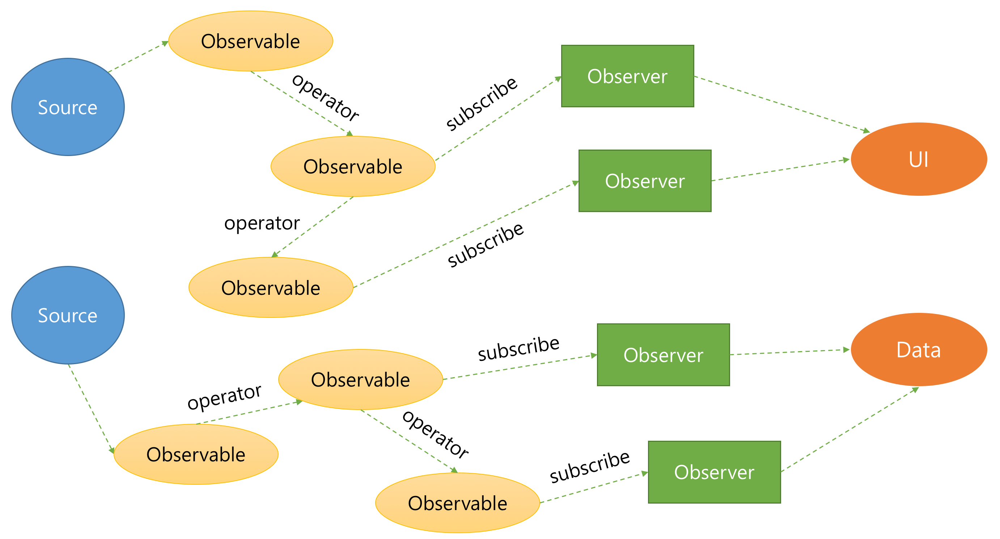

# 1부를 마치며
웹 어플리케이션은 입력, 상태, 로직으로 구성된 상태 머신이다. 
1부에서는 이런 상태머신을 어떻게 하면 안정적으로 개발할 수 있을지에 대한 `RxJS의 고민`에 대한 이야기이다.

### 입력 데이터 오류
RxJS는 동기와 비동기 입력 데이터들을 시간 축을 가진 하나의 컬렉션(Observable)로 보고 단일 방식으로 입력 데이터를 처리한다.

- 동기와 비동기 데이터를 모두 Observable로 일원화 할수 있다.

### 상태 전파 오류
상태의 변경을 효과적으로 즉시 반영하기 위해 기존 Observer 패턴을 개선하여 상태 전파 문제를 해결하려고 하였다.
- Observer는 next, error, complete의 3가지 인터페이스를 가진다.
- Observable은 Read only이기 때문에 단방향의 데이터 흐름을 갖는다.

### 로직 처리의 오류
로직 상에 존재하는 반복문, 분기문, 변수를 제거하기 위해서 함수형 프로그래밍의 근간이 되는 operator를 제공한다.

- Observable은 operator를 통해 항상 가변 객체(Immutable Object)를 반환한다.
- Observable은 operator를 통해 생성, 변환, 병합, 분리와 같은 다양한 형태를 구성할 수 있다.  
이를 그름으로 표현하면 다음과 같이 표현할 수 있다.

2부에서는 1부에서 이해한 Observable 객체를 바탕으로 실제 RxJS로 어플리케이션을 어떻게 구현하고 설계하는지 살펴보도록 하자.
